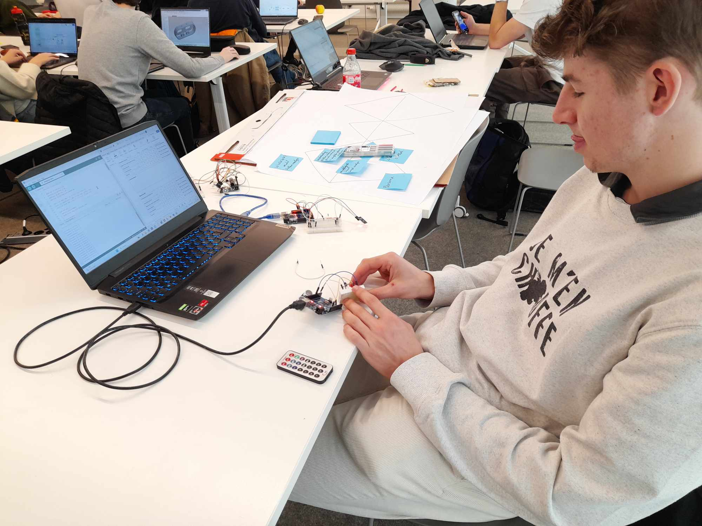
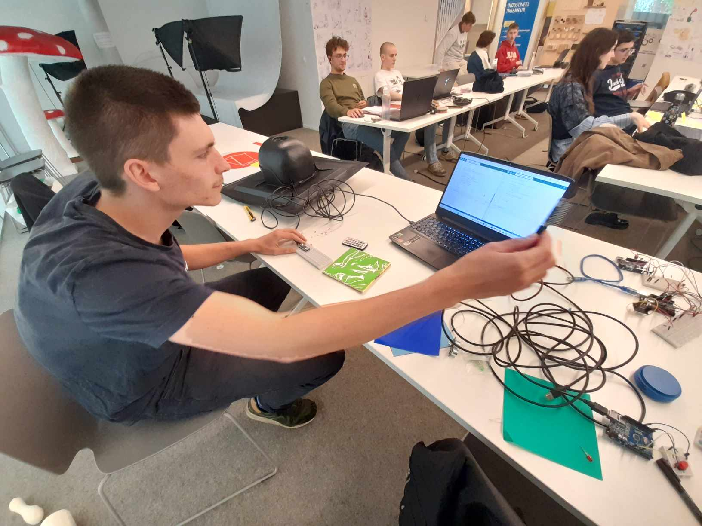

# KampKode

  

KampKode is een innovatieve helm die kinderen laat samen buiten spelen door gebruik te maken van gamification, en spellen visueel sterker maakt.

*Projectteam: Robbe de Guytenaer; Kai Cherchye

22/05/2024

## Samenvatting

Ons project richt zich op het bevorderen van buiten spelen bij kinderen door natuur, spel en technologie te combineren. We pakken het probleem aan van de afname van buiten spelende kinderen, wat kan leiden tot zowel fysieke als mentale gezondheidsproblemen. Buiten spelen biedt veel meer positieve effecten in vergelijking met binnen spelen.

Om dit probleem beter te begrijpen, hebben we uitgebreid gebruikersonderzoek, interviews, literatuuronderzoek en diverse analysetools zoals het WWWWWH-model, persona's en een probleem-oplossingsmatrix toegepast. Uit deze onderzoeken bleek dat er een duidelijke afname is van kinderen die buiten spelen, voornamelijk doordat hun interesse meer gericht is op binnenspeelgoed. Deze trend kan grotendeels worden toegeschreven aan de digitalisering van binnenspeelgoed, terwijl buitenspeelgoed deze ontwikkeling niet heeft gevolgd. Gedigitaliseerd binnenspeelgoed oefent een grotere aantrekkingskracht uit op kinderen dan traditioneel buitenspeelgoed, wat resulteert in een toenemende neiging om binnen te blijven. De resultaten van deze onderzoeken zijn gedocumenteerd in ons Miro-board en deelopdracht 2 in de bijlage. 

Om bestaande oplossingen in kaart te brengen, hebben we marktonderzoek en technologieanalyse uitgevoerd, inclusief benchmarking. Uit deze onderzoeken blijkt dat kinderen meer interesse tonen in speelgoed dat met meerdere personen te spelen is en dat een moderne vorm heeft. Bovendien blijkt dat kinderen gemakkelijker naar speelgoed grijpen dat een link heeft met videogames.

Op basis van deze inzichten hebben we gebrainstormd en een innovatieve oplossing ontwikkeld: KampKode. KampKode is een helm die gebruik maakt van verschillende sensoren en technologieën om buiten spelen visueel aantrekkelijker en leuker te maken voor kinderen. Met deze helm kunnen kinderen in de natuur videospelervaringen nabootsen en samen met hun vrienden actief en lichamelijk bezig zijn. Het dragen van de helm bereidt kinderen voor op spannende spellen die buiten gespeeld kunnen worden, waardoor het buiten spelen weer aantrekkelijk en interactief wordt.

## Introductie

## Definition: discover

### Eerste prototype en eerste gebruikerstest:

Om ons product concreet uit te werken, zijn we begonnen met het maken van eenvoudige schetsen van het idee, gevolgd door een eenvoudig prototype. Voor dit eerste prototype hebben we een bestaande helm aangepast door een schuimen lamp op de bovenkant te bevestigen, waarbij een LED lichtte op bij het indrukken van de lamp. Daarnaast hebben we een staart aan de achterkant van de helm geïntegreerd, waarbij de LED oplichtte bij het trekken aan de staart.
Na het vervaardigen van het eerste prototype hebben we verschillende soorten lampen gemaakt om in de volgende fase tests uit te voeren op personene uit ons doelgroep. Deze tests waren gericht op het evalueren van de eerste ontwerpvereiste, namelijk de verschillende uitschakelmogelijkheden. We hebben vier uitschakelmogelijkheden getest, uitschakelen door te drukken op de lamp bovenaan, uitschakelen door te trekken aan de staart, uitschakelen door te tikken op een flexibele lamp, uitschakelen door het afnemen van een afneembare lamp. Deze tests hielpen ons bij het verzamelen van waardevolle feedback en inzichten, die cruciaal waren voor de verdere ontwikkeling van ons product. De resultaat van de test was als volgt:

**1. Uitschakelen door drukken op de lamp bovenaan**

- Voordelen: Visueel aantrekkelijk, effectief en gemakkelijk te realiseren.
- Nadelen: Risico op letsel bij te hard slaan, veersysteem biedt geen volledige oplossing.
- Geschikte lampen: A, B, E (boven- of achterkant van de helm).

**2. Uitschakelen door trekken aan staart**

- Voordelen: Makkelijk voor kleinere kinderen om grotere kinderen uit te schakelen.
- Nadelen: Risico op letsel door achterwaarts trekken van het hoofd, lastig esthetisch te ontwerpen.
- Geschikte lampen: A, B (bovenop de helm).

  
**3. Uitschakelen door tikken ‘flexibele lamp’**

- Voordelen: Leuk en spannend, veiligere dwarskracht bij harde tikken.
- Nadelen: Uitdaging in detectiemechanisme om juiste tikken te registreren zonder valspositieven.
- Geschikte lampen: B, C, D (overal op de helm).
  
**4. Uitschakelen door afnemen lamp**

- Voordelen: Veiligste optie, eenvoudig te maken met magneetsysteem.
- Nadelen: Helm bestaat uit meerdere delen, oplossing nodig voor beheer van afneembare lamp.
- Geschikte lampen: afneembare lamp vereist)

### Resultaat test 1:

Bij de evaluatie van de concepten waren veiligheidsoverwegingen cruciaal. Concepten (1) en (2) bleken een verhoogd risico op letsel te hebben, zelfs met schokdempingssystemen. Concepten (3) en (4) waren veiliger, mits geoptimaliseerd. We hebben besloten ons te richten op concepten (3) en (4) vanwege hun betere veiligheidspotentieel. Voor concept 3, tikken op de lamp om uit te schakelen, zullen we een sensor ontwikkelen voor nauwkeurige registratie. Voor concept 4, het afnemen van de lamp, ontwerpen we een magneetsysteem voor eenvoudige bevestiging en verwijdering. Deze aanpassingen zullen resulteren in een veiliger en aantrekkelijker product voor buiten spelen.
In de beginfase hebben we uitgebreid onderzoek gedaan naar het probleem, wat een sterke basis legde voor verdere ontwikkeling. Bij het brainstormen misten we echter belangrijke aspecten zoals de behoeften van mensen met beperkingen en financiële overwegingen, die later dankzij de groep uit Gent werden geïntegreerd.
Ons late begin met het prototype beperkte onze mogelijkheden voor interviews en gebruikerstesten, wat de analyse van ons ontwerp beïnvloedde. Tijdens het prototypeproces ontdekten we problemen en kansen die we eerder hadden gemist. Vroegtijdig beginnen met een eenvoudig prototype had waardevolle inzichten kunnen opleveren.
Deze reflectie benadrukt het belang van een holistische benadering tijdens brainstormen en het tijdig ontwikkelen van een eenvoudig prototype. Deze lessen zijn cruciaal voor toekomstige projecten. Voor meer informatie van dit onderdeel kan dit terug gevonden worden in deelopdracht 2 ijn de bijlage.

## Develop 1: Ergonnomie

### Anthropometrische analyse

Na het maken van een eerste ruwe prototype hebben we ons gericht op de ergonomie van de helm. Via de websites DINED en DINBelg hebben we antropometrische data verzameld. DINED biedt gegevens over hoofdomtrek, hoofdbreedte en hoofddiepte, maar beperkt tot kinderen van 7-8 jaar. DINBelg biedt gegevens over hoofddiepte en -breedte voor onze gehele doelgroep van 6 tot 12 jaar.
Voor het bepalen van de helmmaat gebruikten we de ontwerpstrategie "design for the tall." Zoals bij moderne fietshelmen, maken we de helm verstelbaar zodat hij voor zowel de grootste als de kleinste kinderen geschikt is. We hebben de hoofddiepte en -breedte van DINBelg gebruikt vanwege de beperking van DINED tot 7-8 jaar. Voor het ontwerp richten we ons op de 95e percentielmaat (P95) van 12-jarigen, waarbij z95 = 1,645. Dit resulteerde in een benodigde hoofddiepte van 198 mm en een hoofdbreedte van 154 mm.
Voor de hoofdomtrek gebruikten we gegevens van DINED voor 6-8-jarigen en schaalden deze met een factor 1,05, afgeleid uit de verhouding van de hoofdafmetingen tussen 6 en 12 jaar in DINBelg. Dit gaf ons een hoofdomtrek van 561 mm. De standaardafwijking werd overgenomen uit de DINED-tabellen, aangezien deze bij DINBelg voor hoofd diepte en breedte consistent bleef tussen 6 en 12 jaar.
Dit onderzoek gaf ons waardevolle inzichten in de benodigde afmetingen van onze helm. Door voor alle maten "design for the tall" toe te passen en een verstelsysteem te integreren, kunnen we ervoor zorgen dat de helm geschikt is voor alle kinderen binnen onze doelgroep, inclusief degenen die niet tot de uiterste gevallen behoren.

### Gebruikerstest 2:

Daarnaast hebben we een gebruikerstest uitgevoerd om de ergonomie van de helm verder te evalueren. We wilden nagaan of kinderen gemakkelijk met hun hand hun eigen hoofd kunnen bereiken om knoppen op de helm te bedienen, en of ze daarbij enige hinder ondervinden voor, tijdens en na het spel. Tevens onderzochten we de meest geschikte positie voor deze knoppen.
Voor deze test hebben we met het CAD-programma Siemens NX de houdingen van de hand naar het hoofd gesimuleerd om te bepalen of deze houding comfortabel is. De resultaten toonden aan dat deze houding zelfs comfortabeler is dan normaal rechtop staan.
De fysieke gebruikerstest werd uitgevoerd met een eenvoudige helm voorzien van twee kartonnen schijfjes die knoppen nabootsen. Deze schijfjes werden getest op drie verschillende posities: 30°, 50° en 90° ten opzichte van de voorkant van de helm. Voor de evaluatie maakten we gebruik van een evaluatieformulier met twee vragen die de deelnemers moesten beoordelen op een schaal van 1 tot 10: 'Hoe moeiteloos voer je de handeling uit (dus geen fysieke klachten)?' en 'Hoe gemakkelijk was het om tot de knoppen te geraken met je hand?'.

### Resultaat test 2:

De resultaten gaven aan dat de knoppen op 50° de beste scores behaalden en de beweging van de hand naar het hoofd als moeiteloos werd ervaren. Op basis van deze bevindingen hebben we besloten de knoppen op de positie van 50° te plaatsen.
Voor een gedetailleerdere uitwerking van het ergonomie-onderzoek verwijzen we naar deelopdracht 3 in de bijlage.

## Develop 2: Uitschakelmethode

### Gerbruikerstest 3:

In de volgende fase hebben we de uitschakelmethodes verder uitgewerkt om een geschikte methode te kiezen voor integratie in ons product. Hierbij hebben we zowel manuele als digitale uitschakelmethodes met sensoren overwogen. Deze methodes werden onderverdeeld en getest om de beste optie te identificeren. Voor de manuele uitschakelmethodes voerden we gebruikerstesten uit met vier kinderen uit onze doelgroep, aangevuld met onze eigen evaluaties.
De geteste manuele methodes waren:
1. Uitschakelen door te slaan op een flexibele lamp.
2. Een magnetische lamp van de helm trekken.
3. Uitschakelen door binnen een bepaalde radius te komen.
4. Mikken met een pointer op een sensor van de helm.
Voor elke methode werd een eenvoudig prototype gemaakt om het concept te testen. Na elke test vulden de kinderen een evaluatieformulier in, waarbij ze de methodes beoordeelden op een schaal van 1 tot 10 voor de volgende criteria: leukheid, gemak, en veiligheid. De specifieke vragen waren:
- Hoe leuk vond je deze manier van uitschakelen?
- Hoe gemakkelijk ging het om uit te schakelen/uitgeschakeld te worden?
- Is het spel veilig verlopen?
Robbe en Kai vulden het formulier ook in op basis van hun observaties tijdens de tests. De scores werden vervolgens samengevoegd en geëvalueerd om de beste uitschakelmethodes te bepalen.

### Resultaat test 3:

||Mechanisme 1|Mechanisme 2|Mechanisme 3|Mechanisme 4|
|---:|:---:|:---:|:---:|:---:|
|TOTAAL|138|141|144|153|
|relatief|0,767|0,783|0,800|0,850|

Mechanisme 1 en 2, waarbij fysieke aanraking van het hoofd vereist was, bleken minder geschikt bij grote hoogteverschillen tussen spelers. Bovendien kwam de veiligheid meer in het gedrang bij deze methodes, met mechanisme 2 als de iets betere optie. Hoewel oplossingen voor deze problemen mogelijk zijn, blijven ze belangrijke overwegingen.
Mechanisme 3, getest als het klassieke 'tikken', maakte hoogte irrelevant en legde de nadruk op snelheid en tactisch ontwijken. Verschillen hierin kunnen worden opgelost door de helm personaliseerbaar te maken, zoals het instellen van de radius.
Mechanisme 4 gaf de testpersonen het gevoel van een digitaal spel, vergelijkbaar met 'lasershooten'. Hoewel ons product een vorm van lasershooten zou kunnen zijn, biedt dit mechanisme meerdere mogelijkheden. Voor deze methode is verdere ontwikkeling en testing nodig om de technologie te verfijnen.
De testresultaten gaven een duidelijk beeld van de praktische toepassing van elk mechanisme en leverden waardevolle inzichten op. Hoewel de scores niet doorslaggevend waren, hebben ze ons richting gegeven voor verdere ontwikkeling. Mechanismes 3 en 4 scoorden het hoogste, waardoor we besloten de technologie achter deze methodes verder uit te werken en te testen in een expert review. De nodige bijlages van de test is terug te vinden in deelopdracht 4 in de bijlage.

### Expert review:

Na de gebruikerstest hebben we een expert review uitgevoerd met drie medestudenten, waarbij ze de digitale uitschakelmethodes met sensoren beoordeelden. De uitschakelmethodes werden nagebootst met Arduino-aangestuurde sensoren, waaronder een IR-sensor, een kleurensensor, een ultrasoonsensor en Bluetooth-componenten. De IR-sensor en kleurensensor simuleerden een soort lasershooting, terwijl de ultrasoonsensor en Bluetooth-componenten de afstand tussen gebruiker en tegenstander maten om iemand binnen een bepaalde radius te detecteren. De gebruikte Arduino-codes voor deze sensoren zijn terug te vinden in de bijlage.

### Resultaat expert review

Voor de test gebruikten we een evaluatieformulier waarop de medestudenten punten gaven van 1 tot 5 op verschillende aspecten: gebruiksvriendelijkheid, nauwkeurigheid, algemene gebruikservaring, robuustheid en bereik. Daarnaast konden ze extra opmerkingen toevoegen en de sensoren rangschikken van 1 (meest toepasselijk) tot 4 (minst toepasselijk) op basis van hun buitenspeelervaring.

|Totaal score sensoren|Emile Delanote|Oscar Ortega Saez|Warre De Vriendt|Opsomming|
|---:|:---:|:---:|:---:|:---:|
|IR-sensor|20|22|23|65|
|Kleurensensor|21|15|22|58|
|Ultrasoonsensor|21|13|17|51|
|Bluetooth|22|22|25|69|

1. **Bluetooth-componenten**
   - Sterke punten: Hoge waarderingen voor gebruiksvriendelijkheid en bereik. 
   - Zwakke punten: Andere aspecten scoorden ook redelijk hoog (3 tot 4).
   - Conclusie: Bluetooth-componenten werden over het algemeen als zeer bruikbaar beschouwd.
2. **IR-sensor**
   - Sterke punten: Hoge scores op de meeste aspecten.
   - Zwakke punten: Robuustheid scoorde iets lager.
   - Conclusie: De IR-sensor werd als effectief en nauwkeurig beoordeeld, met enige zorgen over robuustheid.
3. **Kleurensensor**
   - Sterke punten: Interessant en leuk concept.
   - Zwakke punten: Beperkt bereik en onnauwkeurige kleurdetectie bij snelle bewegingen.
   - Conclusie: Hoewel leuk, had de kleurensensor praktische beperkingen die het minder geschikt maakten.
4. Ultrasoonsensor
   - Sterke punten: Interessant voor het meten van afstanden.
   - Zwakke punten: Lage scores op alle aspecten; detecteerde ook niet-spelers, wat het gebruik bemoeilijkte.
   - Conclusie: De ultrasoonsensor was minder geschikt door de lage nauwkeurigheid en brede detectie.

Op basis van de evaluatieformulieren en rangschikking kwamen de Bluetooth-componenten en IR-sensor als beste uit de bus. Ze scoorden het hoogst op gebruiksvriendelijkheid, nauwkeurigheid en algemene gebruikservaring. De kleurensensor en ultrasoonsensor bleken minder geschikt vanwege hun beperkingen in bereik, nauwkeurigheid en gebruiksvriendelijkheid.
Daarom hebben we besloten verder te gaan met de Bluetooth-componenten en de IR-sensor. Deze zullen in de volgende fase verder worden ontwikkeld en getest om hun potentieel volledig te benutten. Voor gedetailleerde informatie over de tests verwijzen we naar deelopdracht 4 in de bijlage.

  
  
  

## Develop 3: Hiërarchische taakanalyse

### Hiërarchische taakanalyse:

Voor de laatste aanpassing aan het prototype hebben we een hiërarchische taakanalyse uitgevoerd om de interacties van de gebruiker met de helm te bestuderen. Het doel van deze analyse is om de interacties te optimaliseren en het prototype te verbeteren op basis van de geïdentificeerde optimalisaties. Deze aanpak houdt in dat alle interacties van de gebruiker met het product worden opgesplitst in hoofdtaken, subtaken, sub-subtaken, enzovoort. Door varianten binnen de subtaken te definiëren, kunnen we de beste ontwerpbeslissingen nemen die het meest voldoen aan de wensen van de gebruiker.

We hebben het gebruik van de helm onderverdeeld in vier fasen:
1. **Begin van het spel**
2. **Spelen van het spel**
3. **Einde van het spel**
4. **Na gebruik**

  

### Resultaat taakanalyse:

Door deze interacties gedetailleerd te beschrijven, hebben we nieuwe optimalisaties geïdentificeerd, zoals:

- **Aansteken van de helm door de lamp erop te draaien**: Dit maakt het gebruiksvriendelijker en intuïtiever.
- **Afneembare lamp**: Dit biedt voordelen bij opslag en opladen. Alleen de lamp hoeft opgeladen te worden, wat het proces vereenvoudigt.
- **Losneembare binnenhoes in de helm**: Dit verbetert de hygiëne doordat de binnenhoes gewassen kan worden.

Voor meer gedetailleerde informatie over deze hiërarchische taakanalyse en de specifieke optimalisaties kunt u deelopdracht 5 raadplegen, die in de bijlage is opgenomen.
Door deze verbeteringen door te voeren, streven we naar een prototype dat beter aansluit bij de behoeften van de gebruiker en een hogere mate van gebruiksvriendelijkheid en functionaliteit biedt.

### Gebruikerstest 4:

## Finaal prototype

Na de gebruikerstesten en het opstellen van de design requirements hebben we ons finale prototype ontwikkeld, gemaakt van schuim met een thermovorm eromheen. De belangrijkste kenmerken van dit prototype zijn als volgt:

1. **Afneembare Lamp**: De lamp is geïntegreerd met een LED die oplicht wanneer de lamp op de helm wordt geplaatst. Dit wordt mogelijk gemaakt door een schakelsysteem dat ervoor zorgt dat de LED in de helm alleen aangaat wanneer de lamp correct is bevestigd.

2. **LED en Drukknop**: De helm bevat een LED die wordt aangestuurd door een drukknop. De LED licht op zolang de drukknop is ingedrukt, wat alleen mogelijk is wanneer de lamp volledig op de helm is gedraaid. Dit is zichtbaar in het schakelschema, waaruit blijkt dat de kring wordt gesloten wanneer de lamp op de helm wordt geplaatst, en dat zowel de kring in de lamp als in de helm parallel staan over de batterij. Hierdoor heeft elke kring een gelijke spanning.

3. **Aanspanriem en Strap**: De helm is voorzien van een aanspanriem en een strap, waardoor hij geschikt is voor elk kind. De aanspanriem zorgt ervoor dat de helm goed op het hoofd past zonder te wiebelen, terwijl de strap voorkomt dat de helm van het hoofd valt.

Met deze functies kunnen we effectief testen uitvoeren bij het begin van het spel, tijdens het lopen met de lamp op de helm, aan het einde van het spel en na gebruik. Deze verbeteringen en integraties zorgen ervoor dat het prototype zowel functioneel als veilig is, klaar voor uitgebreide gebruikerstesten in realistische spelomstandigheden.

## Bill of materials
- Schuim: basis van de helm, knoppen
- Polymess: gebruikt om kaft te thermovormen
- Led’s
- Bevestigingsmateriaal (lijm, plakband, tandenstokers)
- Draden
- Helm
- Magneet
- Arduino uno
- Arduino nano 33 iot
- Infraroodsensor
- Infraroodzender
- Lleurensensor
- Rgb led
- Ultrasonorsensor
- Binnenhoes
- Strap
- PLA: 3d prints

## Kritische reflectie

### Positieve Punten

**1. Innovatief Gebruik van Gamification:**
Het gebruik van gamification om kinderen te motiveren om meer buiten te spelen, is een slimme manier om technologie te benutten in de strijd tegen een groeiend probleem. Dit speelt in op de behoeften van de huidige generatie, die vaak meer betrokken raakt bij interactieve en speelse benaderingen.

**2. Consistentie in Ontwerpbeslissingen:**
Vanaf het begin van het project hebben we ervoor gekozen om met een helm te werken. Deze consistente focus heeft ons geholpen om gericht te blijven en de helm door verschillende iteraties te verbeteren. We hebben diverse componenten toegevoegd en verwijderd om het beste resultaat te bereiken.

**3. Gebruik van Methodologieën voor Besluitvorming:**
We hebben meerdere methodologieën, zoals gebruikerstests en expert reviews, toegepast om beslissingen te nemen over de componenten van de helm. Deze benadering zorgde voor een onderbouwde en doordachte ontwikkeling van het product, waarbij de ervaringen en meningen van de doelgroep werden geïntegreerd.

**4. Waardevolle Testervaringen:**
De ervaringen uit gebruikerstests en expert reviews waren zeer waardevol. Ze gaven ons concrete resultaten en feedback die we konden gebruiken om ons ontwerp te verbeteren. Dit iteratieve proces verhoogde de kwaliteit en gebruiksvriendelijkheid van de helm.

### Verbeterpunten

**1. Eerder Starten met Prototype-ontwikkeling:**
Een punt dat beter kon, was het eerder beginnen met het maken van een ruw prototype. Hierdoor hadden we sneller testen kunnen uitvoeren en waardevolle feedback kunnen integreren in ons ontwerp. Dit had ons wellicht tijd en middelen kunnen besparen en de kwaliteit van het eindproduct kunnen verhogen.

**2. Inclusiviteit:**
Het project lijkt zich voornamelijk te richten op kinderen zonder speciale behoeften. Een uitbreiding van het ontwerp om ook kinderen met lichamelijke of cognitieve beperkingen te betrekken, zou de inclusiviteit en impact van het project aanzienlijk vergroten. Dit zou het project toegankelijker en relevanter maken voor een bredere doelgroep.

### Conclusie

Terugkijkend op het traject van het ontwerp van KampKode, zijn we tevreden met ons eindproduct. We hebben sterke punten, zoals het innovatieve gebruik van gamification en een consistente ontwerpaanpak, gecombineerd met waardevolle testervaringen om tot een kwalitatief product te komen. Echter, er zijn ook lessen te leren, zoals het belang van eerder starten met prototyping en het vergroten van de inclusiviteit. Door deze aspecten te verbeteren, kunnen toekomstige projecten nog effectiever en impactvoller worden.
## Bronnen
Meire, J. & Kind & Samenleving. (2020). *Het grote buitenspeelonderzoek.* https://k-s.be/medialibrary/purl/nl/6626949/Het%20grote%20buitenspeelonderzoek.pdf

Kantar Public & Jantje Beton. (2022). *Onderzoek buitenspelen 2022.* https://jantjebeton.nl/uploads/downloads/onderzoek-buitenspelen-2022-62a06183eb380.pdf

DINED. (n.d.). https://dined.io.tudelft.nl/en/database/tool

DINBelg 2005 - antropometrie tabel. (n.d.). https://www.dinbelg.be/index.htm

## Bijlagen
- [Miro board](https://miro.com/app/board/uXjVNZSFQTM=/)
- [Deelopdracht 2](https://github.com/robbedeguytenaer/UCD_SEM1/blob/2638a34ac7d188e0727b5353b86f76b70f02b451/README.md)
- [Deelopdracht 3](https://github.com/robbedeguytenaer/deelopdracht-3)
- [Deelopdracht 4](https://github.com/robbedeguytenaer/deelopdracht-4)
- [Deelopdracht 5]()
